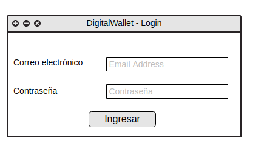
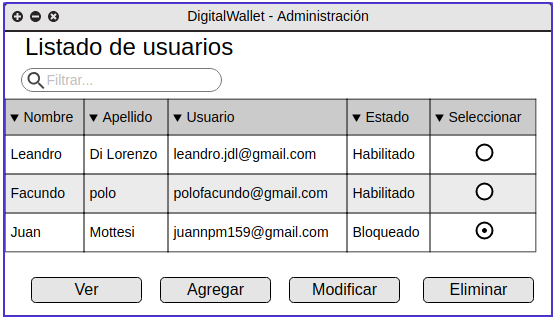
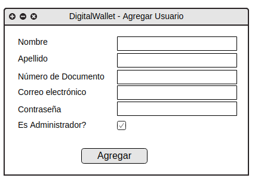
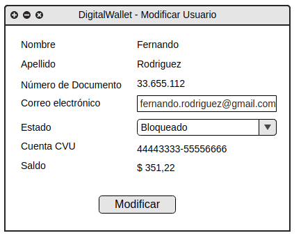
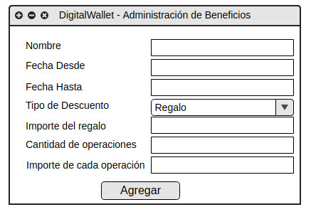

# UIs » TP1 » 2°C 2019

## DigitalWallet » Desktop Arena

Un inversor está buscando desarrollar una plataforma financiera para
administrar dinero y fomentar el uso de dinero digital para realizar
operaciones sin necesidad del billete físico. Para esto quiere construir
una billetera virtual donde los usuarios podrán acceder a:

- Registrarse (enrollment)
- Ingresar dinero (cash in)
- Transferir dinero (cash out)
- Programa de beneficios por el uso (loyalty)

### Parte 1: Dominio

#### Especificaciones

DigitalWallet busca ser una Billetera Virtual que administre dinero
virtual, para esto, se podrán realizar las siguientes operaciones:

##### 1. Registrarse (enrollment)

Los usuarios deberán proveer la siguiente información:

- Nombre
- Apellido
- Número de documento
- Correo electrónico (nombre de usuario) - único en el sistema
- Clave

Una vez realizado el registro el sistema deberá crear una cuenta que
deberá contener:

- CVU (Clave Virtual Uniforme) - única en todo el sistema
- Saldo
- Lista de movimientos - es un listado de movimiento que tuvo la
    cuenta: cash in o cash out.

> Nota: para fomentar el uso de la aplicación, el inversor decide regalar
> $200 por registrarse en la aplicación.

##### 2. Login

Los usuarios registrados podrán realizar un login en la aplicación
utilizando el correo electrónico y clave.

##### 3. Transferir dinero (cashout)

Los usuarios registrados en el sistema podrá transferir dinero a otro
usuario de la plataforma.

Para poder realizar la transferencia de dinero, el usuario emisor debe
conocer la Clave Virtual Uniforme dado que el sistema se lo va a
requerir y por otro lado debe disponer de saldo suficiente para realizar
la transferencia.

Una vez realizada la transferencia, se debe descontar del usuario emisor
el saldo de la cuenta correspondiente e incrementar el saldo en la
cuenta del usuario receptor y registra el movimiento en ambas cuentas.

De cada Movimiento se conoce:

- Fecha y hora
- Tipo de movimiento (cash in, cash out)
- Importe
- Nombre del originante/destinatario
- CVU del originante/destinatario

##### 4. Ingresar dinero (cash in)

Los usuarios registrados en el sistema podrá ingresar dinero a
DigitalWallet, para esto existen 2 formas de realizarlo:

- Tarjeta de crédito/débito.
- Una transferencia (caso anterior) de un usuario de DigitalWallet

En el caso del ingreso a través de tarjeta de débito o crédito
se le solicitará al usuario la siguiente información de la tarjeta:

- PAN - número de dieciséis dígitos que identifican la tarjeta de
    crédito o débito
- Nombre y Apellido
- Fecha de vencimiento - en el formato dd/mm/aaaa
- CVV - Clave de 3 dígitos del dorso de la tarjeta
- Importe a acreditar

##### 5. Programa de beneficios (Loyalty)

Los usuarios administradores podrá ingresar a DigitalWallet para
administrar un programa beneficios por el uso de la billetera. El
objetivo del mismo es captar nuevos clientes a que hagan uso de la
plataforma.

IMPORTANTE: el beneficio puede ser aplicado una única vez por cliente,
es decir, una vez cumplido el beneficio el mismo no se puede volver
aplicar para el mismo cliente.

De los beneficios se debe registrar:

- Nombre
- Tipo de Beneficio (descuento o regalo)
- Porcentaje de descuento (en caso de ser descuento)
- Importe de Regalo (en caso de ser regalo)
- Cantidad de operaciones (\*)
- Importe de Cada Operación(\*\*)
- Vigencia Fecha Desde
- Vigencia Fecha Hasta

> (*) El beneficio le aplica a aquellos usuarios que superen la cantidad
> de operaciones de cash out.
>
> (**) El beneficio le aplica a aquellos usuarios que superen la
> cantidad de operaciones indicada en (\*) y el valor de cada operación de
> cash out sea superior a lo indicado en Importe de Cada Operación.

Ejemplo 1 de funcionamiento del programa de beneficios:

Transferencia o cashout: $1000

Beneficio: Cantidad de Operaciones

Fecha Desde: 10/11/2019

Fecha Hasta: 20/11/2019

Tipo de beneficios: Descuento

Porcentaje de descuento: 10%

Cantidad de operaciones: 5

Importe de cada operación: $100

Cuando un usuario va a realizar un cash out por $1000, el sistema debe
calcular si el usuario realizó más de 5 operaciones por un importe mayor
a $100 cada una. En caso de aplicar el descuento, se genera un
reintegro (cash in) por el valor del descuento del 10% en la
transferencia. Esto implica generar dos movimiento en la cuenta:

- Cash out por $1000
- Cash in por $10

Ejemplo 2 de funcionamiento del programa de beneficios:

Transferencia o cashout: $2000

Beneficio: Cantidad de Operaciones

Fecha Desde: 10/11/2019

Fecha Hasta: 20/11/2019

Tipo de beneficios: Regalo

Importe de Regalo: $200

Cantidad de operaciones: 2

Importe de cada operación: $50

Cuando un usuario va a realizar un cash out por $2000, el sistema debe
calcular si el usuario realizó más de 2 operaciones por un importe mayor
a $50 cada una. En caso de aplicar el regalo, se genera un regalo (cash
in) por el valor de $200 . Esto implica generar dos movimiento en la
cuenta:

- Cash out por $2000
- Cash in por $200

#### El modelo responde las siguientes peticiones

1. Registrar usuario de DigitalWallet.
2. Eliminar Usuarios de DigitalWallet.
3. Obtener el listado de usuarios del sistema indicando si es
    Administrador.
4. Login mediante correo electrónico y contraseña.
5. Transferir dinero de un CVU Origen a un CVU destino.
6. Ingresar Dinero a DigitalWallet mediante tarjeta de cŕedito.

### Interfaz desktop

Esta particular empresa está interesada en que la administración de la
aplicación sea mediante una interfaz desktop desarrollada con
[Arena](https://www.google.com/url?q=http://arena.uqbar-project.org/&sa=D&ust=1598136095953000&usg=AOvVaw0_W9p2rxq4hJea-kEZ83Xu)
. El hecho de ser desktop les permite que un grupo acotado de personas
se encarguen de gestionar la aplicación sin disponer de un un sistema de
roles y accesos.

Esta interfaz será utilizada a modo de backend para realizar acciones
que permitan a los usuarios operar con la billetera virtual.

También se pretende que mediante esta interfaz se puedan realizar
distintos tipos de búsquedas para que el equipo de marketing pueda
analizar estrategias de publicidad personalizadas.

A continuación se detallan las ventanas solicitadas que se deberán
desarrollar. Los mockups planteados son a modo de ejemplo y guía, pero
cada equipo tiene la libertad de diseñar a gusto, siempre y cuando se
pueda cumplir con la funcionalidad descrita.

#### Login DigitalWaller

Al ejecutar la aplicación deberá mostrarse una ventana de Login del
administrador.

##### Administrar DigitalWallet

Se debe poder visualizar los datos de los usuarios registrados y
realizar acciones, como se muestra a continuación a modo de ejemplo:

#### Agregar Usuario

#### Modificar Usuario

#### Administración de beneficios

#### Consideraciones

- Los usuarios solo pueden ser eliminados, si no disponen de saldo
    positivo en su cuenta, es decir, la cuenta asociada al usuario debe
    disponer de saldo 0 (cero) para poder ser eliminado el usuario.
- Los usuarios de la aplicación solo pueden disponer de una única
    cuenta en la moneda pesos.
- Los paneles son maquetas de la información requerida, pero el diseño
    puede variar a gusto.
- Si bien la plataforma debe poder administrar información, se puede
    mantener información de base hardocodeada y esa información puede
    ser \"levantada\" cuando se inicia la aplicación.
- Además de las pantallas ejemplificadas debe haber ventanas que
    simplemente muestren la información del contenido ("Ver")

### Entrega

La entrega es presencial y deben estar presentes todos los integrantes
del equipo. De existir alguna situación de fuerza mayor se deberá avisar
a los docentes con antelación.

Para organizar mejor las correcciones vamos a establecer horarios para
cada grupo.
