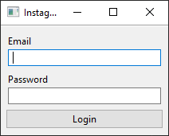
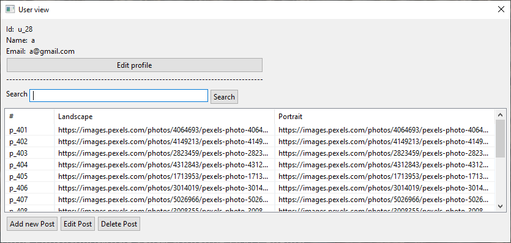
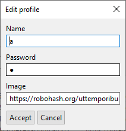
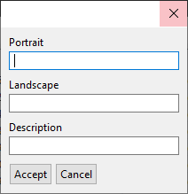
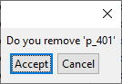

# UIs » TP1 » 2°C 2020

## Instagram » Desktop Arena

Se debe realizar una aplicación de escritorio utilizando
[Arena Framework](http://arena.uqbar-project.org/).
Se debe armar un **ABM de Post** en donde el usuario (`User`) debe poder:

- loguearse **(no hace falta registrarse)**
- crear un post
- modificar un post
- eliminar un post

> Para poder _loguearse_ se pueden agregar los usuarios al `InstagramSystem`
> de forma _hardcodeada_ en el código, utilizando la función `register`.
> Ejemplo:
>
> ```kotlin
> val system = InstagramSystem()
> system.register("Jon Snow", "jon@snow.com", "ghost", "https://bit.ly/3496Vje")
> ```

### Ejemplos de Ventanas

> Están ventanas son a modo de ejemplo para que se comprenda la funcionalidad.
> El alumno tiene total libertad de diseño siempre y cuando se mantenga la funcionalidad.

#### Login



#### Vista del usuario



#### Editar informacion del usuario



#### Agregar y editar una nota

> Cuando se edita un post se deben que cargar los datos previos.



#### Confirmación al eliminar un Post



#### Opcional

- Hacer el registro de usuarios.
