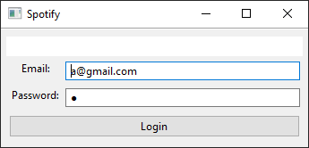
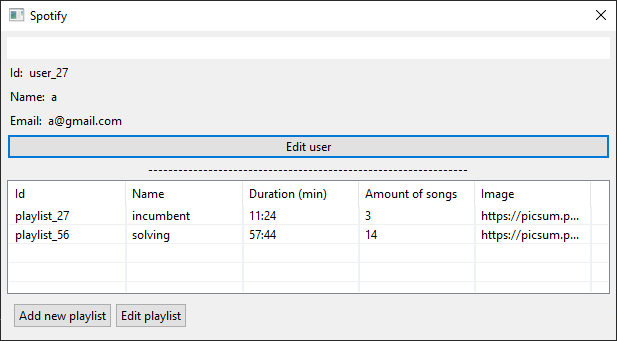
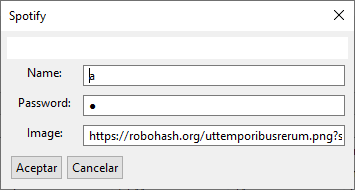

# Interfaz Desktop con Arena

Se debe realizar una aplicación de escritorio utilizando [Arena Framework](http://arena.uqbar-project.org/).
La aplicación requiere que el usuario pueda hacer las siguientes acciones:
* Loguearse.
* Poder ver sus listas de reproduccion.
* Agregar una nueva lista de reproduccion.
* Modificar una lista de reproduccion.
* Modificar perfil de usuario

_Algunas aclaraciones:_
- Una Playlist es valida si, constiene por lo menos una cancion y su nombre no esta repetido en el sistema.

> Como utilizar el modelo
>
> ```kotlin
> val spotifyService = getSpotifyService()
> ```
>
> Usuario:
>
> *Email*: a@gmail.com
>
> *Password*: a


### Ejemplos de Ventanas

> Están ventanas son a modo de ejemplo para que se comprenda la funcionalidad.
> El alumno tiene total libertad de diseño siempre y cuando se mantenga la funcionalidad.

#### Login



#### Vista del usuario



#### Editar informacion del usuario



#### Agregar y editar una playlist

> Cuando se edita una playlist se deben cargar los datos previos.


