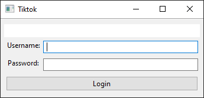
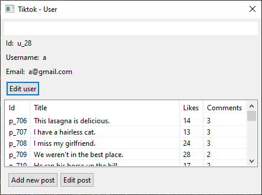
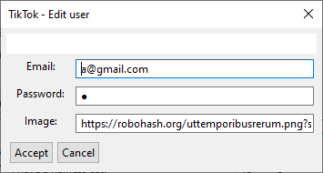
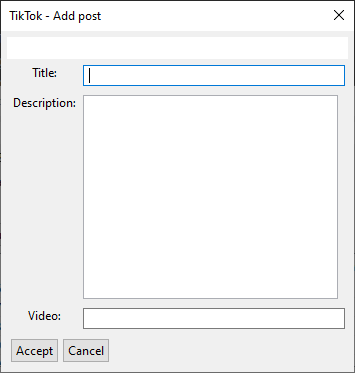

# Interfaz Desktop con Arena

Se debe realizar una aplicación de escritorio utilizando [Arena Framework](http://arena.uqbar-project.org/).

La aplicación requiere que el usuario pueda hacer las siguientes acciones:
* Loguearse
* Ver la lista de sus posteos.
* Crear/Editar un post.
* Editar su informacion personal

_Algunas aclaraciones:_
- Un Post es valido si, tiene un titulo, una descripcion y un video.

> Como utilizar el modelo
>
> ```kotlin
> val system =  Bootstrap().getSystem()
> ```


### Ejemplos de Ventanas

> Están ventanas son a modo de ejemplo para que se comprenda la funcionalidad.
> El alumno tiene total libertad de diseño siempre y cuando se mantenga la funcionalidad.

#### Login



#### Vista del usuario



#### Editar informacion del usuario



#### Agregar y editar un Post


