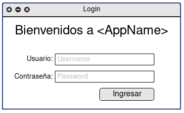
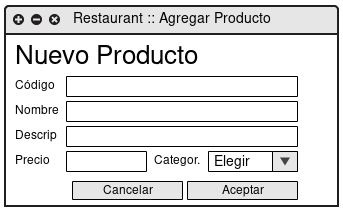
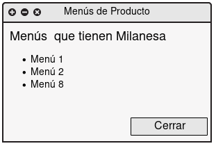
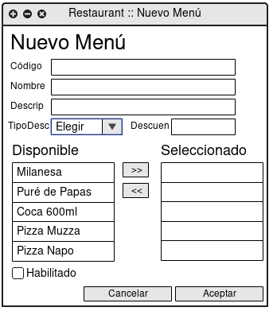

## TP1 >> Backend Desktop

Se requiere armar una aplicación de escritorio para poder administrar restaurantes. La aplicación deberá conocer con qué restaurantes cuenta y quienes son los usuarios registrados que podrán hacer pedidos por la plataforma.
Además, cada restaurant necesita conocer sus productos y sus menús.

### Información de Modelo

#### Aplicación

* Listado de Restaurantes
* Listado de Usuarios registrados
* Medios de Pagos disponibles
  * Efectivo
  * Tarjeta de Crédito
  * Tarjeta de Débito
  * PayPal
  * MercadoPago
  * etc...

#### Restaurant

* Código (único en el sistema)
* Nombre
* Descripción
* Usuario Supervisor
* Dirección
* Coordenadas geográficas (*)
* Medios de pagos habilitados (**)

Cada restaurant tienen que tener asignado un usuario supervisor, el cual será el encargado de administrar
los productos y menús que ofrece ese restaurant.

> (*) Las coordenadas geográficas son una manera de identificar unívocamente
> cada punto del globo terrestre sin ambigüedades.
> Son un par ordenado `(latitud, longitud)` que indica la posición
> del punto a partir del eje cartesiano formado por el Ecuador y el Meridiano de Greenwich.
> Las coordenadas suelen expresarse en grados sexagesimales `(34°42'22.4"S, 58°16'42.6"W)`,
> aunque también es común que se expresen en grados decimales `(-34.706228, -58.278509)`.
> Esta es la información que utiliza cualquier sistema de GPS para navegar correctamente.
> 
> (**) Según lo medios habilitados por la aplicación.

#### Usuario Supervisor

* Nombre de usuario (único en el sistema)
* Contraseña
* Restaurant al que pertenece

#### Usuario

* Nombre de usuario (único en el sistema)
* Contraseña
* Fecha de registro
* Dirección
* Coordenadas Geográficas
* Pedidos Realizados

#### Pedidos

* Código (único en el sistema)
* Fecha
* Usuario
* Restaurant
* Menús
* Estado (*)
  * Entregado
  * Pendiente
  * En Camino
  * Cancelado

> (*) Los estados son fijos, o sea que los provee el código y no son administrables por la aplicación.

#### Producto

* Código (único en el restaurant)
* Nombre
* Descripción
* Precio
* Categoría (*)
  * Entrada
  * Plato Principal
  * Bebida sin alcohol
  * Postre
  * etc...

Además los restaurantes pueden crear crear menús con diversos productos.

> (*) Las categorías debieran ser dinámicas y contar con un panel de administración.
> Pero por simplicidad vamos a permitir que estén _hardcodeadas_ en el código.

#### Menú

* Código (único en el restaurant)
* Nombre
* Descripción
* Listado de productos con sus cantidades
* Descuento opcional (puede ser porcentual o fijo)
* Habilitado/Deshabilitado

El costo del menú se deberá auto-calcular en base a los productos, sus cantidades
y el descuento aplicado a ese menú.

### Parte 1: Modelo

1. Elegir un nombre de fantasía para la aplicación (que no sea _Rappi_, _PedidosYa_, etc...)
2. Programar en Kotlin el modelo de datos en base al dominio especificado.
3. Realizar todos los tests que considere pertinente. 
4. Se deberá poder buscar:
   1. restaurant por código (búsqueda exacta)
   2. restaurant por string (búsqueda parcial)
   3. restaurant tanto por código como por string
   4. menús por string en todos los restaurantes (y retornar `[menú, restaurant]`)
   5. menús por string en un restaurant dado
   6. menús y/o restaurantes por string
5. Un usuario debe poder hacer un pedido con las siguientes características:
   * El pedido debe contar con los siguientes elementos:
     - Restaurant
     - Listado de menús con su respectiva cantidad
     - Medio de pago
   * Se deberán validar los siguientes casos, tirando un excepción acorde si no se cumple que:
     - Todos los menús de la lista deben pertenecer al mismo restaurant.
     - El listado de menús no esté vacío.
     - El medio de pago indicado sea aceptado por el restaurant.
     - El restaurant se encuentra a más de 20km del domicilio del usuario
   * Se puede asumir que el restaurant tiene stock suficiente para aceptar el pedido.
6. Dar de alta a usuarios que quieran hacer utilizar la aplicación para hacer pedidos.
7. Dado un usuario, poder conocer el historial de sus pedidos.
 
> Importante: En caso de existir decisiones que se deban tomar y no estén especificadas
> en este enunciado, se puede elegir libremente la mejor decisión que consideren pertinente.

### Parte 2: Interfaz Desktop con Arena

Se deberán programar las siguientes ventanas:

#### Login para responsables de productos

La aplicación deberá permitir que un responsable se identifique para poder
administrar los productos y menús de sus restaurant. No es necesario que
exista un rol de administrador para cargar restaurantes. Los restaurante
pueden (y deben) estar _hardcodeados_ en el código.

> No es buena práctica tener información de dominio _hardcodeada_
> en el código. Se permite en este caso para no hacer más engorroso
> el trabajo práctico, ya que tampoco aporta demasiado.

#### Ventana Principal

La ventana principal deberá mostrar dos listados, por un lado el listado
de productos con su precio y por el otro el listado de menús con su precio
y si está o no habilitado.

#### Ventana de Agregar Producto

Dado un producto seleccionado, se deberá poder agregar un nuevo producto.

#### Ventana de Modificar Producto

Dado un producto seleccionado, se deberá poder modificar su información.

#### Ventana de Visualización de Menús para un Producto

Dado un producto seleccionado, se deberá poder visualizar los menús a los que pertenece.

#### Acción de Eliminación de un Producto del Restaurant

Un producto puede ser eliminado si no pertenece a ningún menú.
Para poder eliminar un producto existen dos alternativas:

1. Al seleccionar un producto, sólo habilitar el botón de eliminar si no pertenece a ningún menú.
2. Mantener siempre el botón de eliminar habilitado pero en caso de que pertenezca a un menú pero
   no permitir la eliminación y mostrar un mensaje de error.

#### Ventana de Visualización de Menú

Dado un menú, se deberá poder visualizar los productos que contiene.

#### Ventana de Agregar Menú

Ventana para poder agregar un nuevo menú. Se deberá ir visualizando el precio del menú
a medida que se van agregando productos.

_OPCIONAL: Posibilidad de agregar nuevos productos desde la ventana de Menú_

#### Ventana de Modificar Menú

Ventana para poder modificar la información de un menú. Se deberá respetar
la misma funcionalidad planteada en la ventana de agregar.

