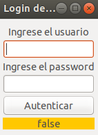
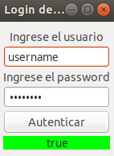
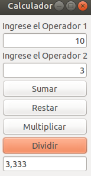
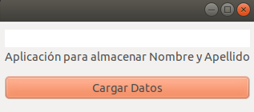
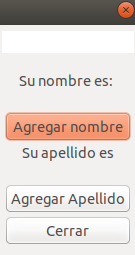
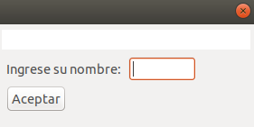

# Práctica 2 >> Interfaz Desktop - Arena

Realizar los ejercicios utilizando el framework Arena y Kotlin.

> **VM arguments**
>
> Para poder ejecutar código arena es necesario configurar el _classLoader_ con:
>
> `-Djava.system.class.loader=org.uqbar.apo.APOClassLoader`
>
> En _IntelliJ_ se debe agregar el Class Loader en _Run > Edit Configurations > VM Options_.

## Ejercicio 1: Login

Escribir un programa que permita visualizar una ventana de Login como la siguiente imagen:

El usuario debe poder ingresar usuario y contraseña, al presionar en el botón Autenticar debe verificar que ambos campos son válidos. Se debe indicar en algún lugar de la ventana si ambos campos son válidos o no, por ejemplo, como en la siguiente imagen:

## Ejercicio 2: Calculadora

Escribir un programa que permita visualizar una ventana de una Calculadora como en la siguiente imagen:

El usuario debe poder ingresar el operando 1 y operando 2 y luego 4 botones: Sumar, Restar, Multiplicar y Dividir.
Al presionar cualquier de los botones, se debe realizar el calculo correspondiente a la operación utilizando los valores ingresados en cada operando.
Nota: contemplar división por cero.

## Ejercicio 3: Nombre y Apellido

Escribir un programa que permita al usuario agregar su nombre y apellido, como se muestra a continuación.

Para poder agregar el nombre y el apellido, debe hacer click en el botón correspondiente, cada botón debe abrir un Dialog de Arena.

## Ejercicio 4: Compañía

Escribir un programa que permita realizar un listado de los clientes pertenecientes a una compañía. Para la resolución debe utilizar el componente Table de Arena.

## Ejercicios extra

### Extra 1

Hacer una ventana que contenga

- un label Nombre acompañado de un campo editable
- un label Apellido acompañado de un campo editable
- un label saludo

Cuando el usuario escriba Nombre o Apellido en el label saludo debe escribirse el string "Hola " + nombre + " " + apellido.

### Extra 2

Hacer una ventana que contenga

- un label Operando1 acompañado de un campo editable numérico
- un label Operando2 acompañado de un campo editable numérico
- un botón que puede ser "+", "-", "*" ó "/"
- un label resultado

Cuando el usuario presione el botón debe calcularse el resultado y mostrarse en el label.

**Variante:** hacer la operación por defecto (elija una) a medida que se modifiquen los operandos 1 ó 2.

### Extra 3

Hacer una ventana que contenga

- un label Frase acompañado de un campo editable
- un label Conversión

Cuando el usuario escriba una frase debe aparecer en el label Conversión la palabra al revés.

**Bonus:** si la palabra es palíndromo debe aparecer en azul, o bien en rojo si no lo es.

> Un palíndromo es Palabra o expresión que es igual si se lee de izquierda a derecha que de derecha a izquierda.

### Extra 4

Hacer una ventana que contenga un campo con un label Tweet, y un campo texto editable de 140 caracteres. Conforme el usuario va escribiendo debería decrementarse la cantidad de caracteres libres (140 - longitud del tweet)

*BONUS 2:* No dejar escribir al sobrepasar los 140 caracteres.
*BONUS 2:* Cuando queden menos de 5 caracteres mostrar el número en rojo.

### Extra 5

Se tiene un combo de productos, objetos que tienen como propiedades precio de venta y descripción. Al seleccionar un elemento debe mostrar en otro label el precio de dicho producto.

### Extra 6

Realizar el conversor de Celsius a Fahrenheit o viceversa mediante dos campos editables. Cuando se modifique uno debe actualizarse el valor del otro.

### Extra 7

La pantalla debe tener un campo fecha editable `dd/MM/yyyy`. A medida que escribe la fecha debe determinar si es válida, y en caso afirmativo, calcular cuántos días pasaron desde el día de hoy hasta esa fecha (puede ser negativo a priori).

**BONUS:** Permitir ingresar sólo fechas anteriores.

### Extra 8

Ingresar un campo fecha editable en formato `dd/MM/yyyy` y cuando sea válida mostrarla en un label en formato `MM-dd-yyyy`.

**BONUS:** Si la fecha es posterior a la fecha de hoy mostrarla en verde, si es la fecha de hoy mostrarla en azul y si es anterior a la fecha de hoy mostrarla en amarillo.