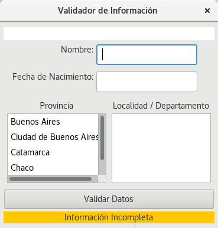
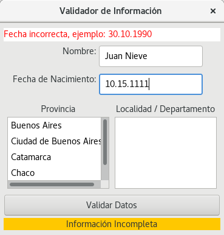
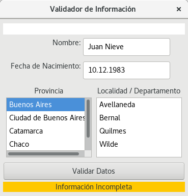
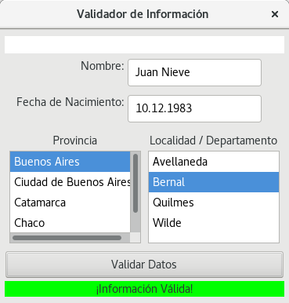
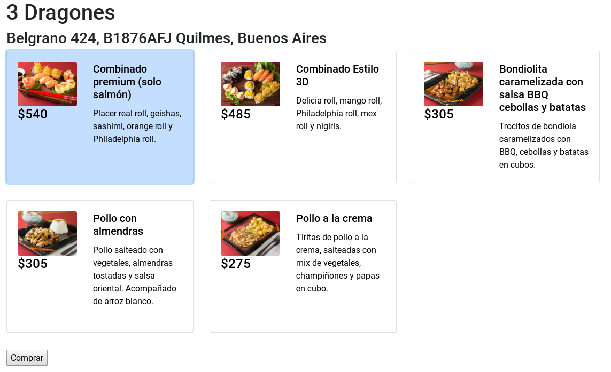

# UIs » Recuperatorio » 2°C 2018

> **06/12/2018**


## Ejercicio 1: Desktop

1. (1 pto.) Responder justificadamente: ¿Qué es un Transformer y para qué se usa? ¿Qué ventajas trae?
2. (4 ptos.) Dada la ventana de Arena planteada, completar el código necesario.






> Cuando están todos los datos completos y se _cliquea_ en el botón Validar Datos,
> el cartel de información se pone verde con la leyenda "¡Información Válida!".
> Si se cliquea cuando aún falten datos, se muestra en naranja con la leyenda "Información Incompleta",
> lo mismo que cuando recién se inicia la ventana. Por otro lado, el campo Fecha de Nacimiento tiene
> una validación para que se cumpla con el formato solicitado (revisar el mensaje de error en el panel
> de error para determinar el formato). Los campos Provincia y Localidad/Departamento están vinculados,
> o sea, las localidades dependen de la provincia que se haya seleccionado y se completan según
> la provincia que se haya seleccionado.

Se provee el siguiente código estructural (puede asumir imports y annotations):

```xtend
class ValidationWindow extends MainWindow<ValidationAppModel> {
  def static main(String[] args) {
    new ValidationWindow(new ValidationAppModel).startApplication
  }
  new(ValidationAppModel model) { super(model) }
  override createContents(Panel mainPanel) {
    /* TODO: Completar componentes */
    new Label(mainPanel) => [ // Validador
      (background <=> "isValid").transformer = new ValidationColorTransformer
      value <=> "isValidMessage"
    ]
  }
}

class ValidationColorTransformer implements ValueTransformer<Boolean, Color> {
  override getModelType() { Boolean }
  override getViewType() { Color }
  override viewToModel(Color valueFromView) { null }
  override modelToView(Boolean valueFromModel) {
    if (valueFromModel) Color.GREEN else Color.ORANGE
  }
}

class DateTransformer implements ValueTransformer<LocalDate, String> {
  /* TODO: Completar implementación */
  /* Formatter: f = DateTimeFormatter.ofPattern("<xxxxxxxx>") */
  /* LocalDate a String: date.format(f)
     String a LocalDate: LocalDate.parse(string, f) */
}

class ValidationAppModel {
  String name = ""
  LocalDate birthDate = null
  List<String> provinces
  String selectedProvince = ""
  Map<String, List<String>> localities
  Boolean isValid = false
  List<String> localitiesFromProvince
  String selectedLocality = ""
  String isValidMessage = "Información Incompleta"
  
  new() {
    provinces = #["Buenos Aires", "Ciudad de Buenos Aires", "Catamarca", "Chaco", "Chubut"]
    localities = new HashMap<String, List<String>>
    localities.put("Buenos Aires", #["Avellaneda", "Bernal", "Quilmes", "Wilde"])
    localities.put("Ciudad de Buenos Aires",#["Balvanera","La Boca","Palermo","San Telmo"])
    localities.put("Catamarca", #["Santa María", "Santa Rosa", "Tinogasta"])
    localities.put("Chaco", #["Bermejo", "Chacabuco", "Maipú"])
    localities.put("Chubut", #["Rawson", "Sarmiento", "Telsen"])
  }
  
  def setSelectedProvince(String selected) {
    selectedProvince = selected; selectedLocality = ""; updateLocalities
  }
  
  def void updateLocalities() {
    if (selectedProvince.isNullOrEmpty) { localitiesFromProvince = #[] }
    else { localitiesFromProvince = localities.get(selectedProvince) }
  }
  /* TODO: Completar la implementación */
}
```

## Ejercicio 2: Web

1. (1 pto.) Armar un router en ReactJS que cumpla con las siguientes condiciones:

| Path                     | Componente |
|--------------------------|------------|
| `/`                      | Home       |
| `/register`              | Register   |
| `/login`                 | Home       |
| `/:userId`               | UserHome   |
| `/:userId/history`       | History    |
| `/:userId/:restaurantId` | Restaurant |
| `/:userId/search`        | Search     |
| `/error`                 | Error      |

> **Consideraciones**
>
> - No hace falta que escriba los imports pero sí la declaración de la clase.
> - Preste atención a los matcheos de las url.
> - No hace falta pasarle los params de ruteo

2. (3 ptos.) Dada la siguiente ventana web, escriba el componente ReactJS que la renderiza.



> **Consideraciones**
>
> - Cuando un elemento tiene fondo (como el primero de la imagen), significa que ese
>   elemento se encuentra > seleccionado y los otros no. Esto quiere decir que cada tarjeta
>   puede ser seleccionada (manteniendo las > selecciones anteriores).
> - El botón Comprar sólo aparece cuando se tiene seleccionado por lo menos un elemento.
>   Para simular la acción de comprar puede asumir que existe un endpoint
>   `POST http://localhost:3003/buy` que requiere recibir por body los id de los menúes seleccionados.
>   O sea, puede asumir que existe pero debe llamarlo desde el componente.
> - Puede asumir que existe un endpoint `GET http://localhost:3003/restaurant/:id`
>   el cual retorna el siguiente JSON:
>
> ```json
> {
>   "data": {
>     "name": "3 Dragones",
>     "address": "Belgrano 424, B1876AFJ Quilmes, Buenos Aires",
>     "menus": [
>       {
>         "id": "1",
>         "name": "Combinado premium (solo salmón)",
>         "description": "Placer real roll, geishas, sashimi, orange roll y Philadelphia roll.",
>         "image": "https://img.pystatic.com/products/eeab10f86470.jpg",
>         "amount": 540
>       },
>       {
>         "id": "2",
>         "name": "Combinado Estilo 3D",
>         "description": "Delicia roll, mango roll, Philadelphia roll, mex roll y nigiris.",
>         "image": "https://img.pystatic.com/products/eb42a14ef955.jpg",
>         "amount": 485
>       },
>       {
>         "id": "3",
>         "name": "Bondiolita caramelizada con salsa BBQ cebollas y batatas",
>         "description": "Trocitos bondiola caramelizados BBQ, cebollas y batatas en cubos.",
>         "image": "https://img.pystatic.com/products/ca8cafc5ee20.jpg",
>         "amount": 305
>       },
>       {
>         "id": "4",
>         "name": "Pollo con almendras",
>         "description": "Pollo salteado con vegetales,almendras tostadas y salsa oriental.",
>         "image": "https://img.pystatic.com/products/1f55f8cb61ad.jpg",
>         "amount": 305
>       },
>       {
>         "id": "5",
>         "name": "Pollo a la crema",
>         "description": "Tiritas pollo a la crema, mix vegetales champiñones y papas cubo.",
>         "image": "https://img.pystatic.com/products/31831f80a62d.jpg",
>         "amount": 275
>       }
>     ]
>   }
> }
> ```
>
> -Existe una función llamada `chunk(Array, amountOfElementPerList)` dado una lista
> de elementos y un número, esta realiza un _split_ de `N` elementos. Ej:
>
> ```js
> var a = [1,2,3,4,5,6,7];
>     chunk(a, 2) => [[1,2], [3,4], [5,6], [7]]
>     chunk(a, 3) => [[1,2,3], [4,5,6], [7]]
>     chunk(a, 1) => [[1], [2], [3], [4], [5], [6], [7]]
> ```
>
> - Puede asumir que puede hacer llamadas REST de la forma `Api.get("url")...`

3. (1 pto.) Agregar la posibilidad de marcar un menú como favorito.

> **Consideraciones**
>
> - No hace falta escribir comportamiento javascript, sólo el maquetado en HTML
> - No hace falta interactuar con la API REST
