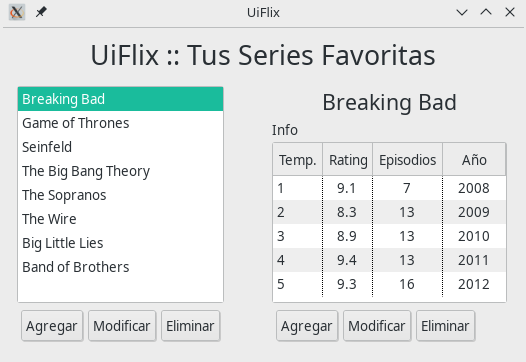

# UIs » Recuperatorio » 1°C 2019

> **18/07/2019**


## Ejercicio 1 (3 puntos)

1. Describa con sus palabras cuál es el rol que cumple la jerarquía de `Windows<T>`
   en el framework Arena (para qué se usa, qué representa, etc…).
2. Compare las características de las siguientes clases:
    - `SimpleWindow<T>`
    - `MainWindow<T>`
    - `Dialog<T>`

## Ejercicio 2 (2 puntos)

Dada la siguiente ventana de Arena



1. Defina con sus palabras el concepto de Layout e indique los diferentes
   tipos de layouts que se implementan en Arena, comentando sus particularidades.
2. Identifique y describa (justificadamente) los distintos layouts utilizados en la ventana.

## Ejercicio 3 (2 puntos)

1. Dado el recurso "movies", defina el protocolo REST básico para que sea considerado CRUD.
2. Dado el siguiente código, defina un request válido para POST /movies.

```kotlin
fun main() {
  val app = Javalin.create().start(7000)
  val controller = Controller()
  app.routes {
    path("movies") {
      get { ctx -> ctx.json(controller.movies()) }
      post { ctx ->
        ctx.status(201); val newMovie = ctx.body<Movie>(); ctx.json(controller.addMovie(newMovie))
      }}}
}
class Controller {
  private var lastId = 0
  private val movies = mutableListOf<Movie>()
  fun addMovie(movie: Movie): Movie { movie.id = ++lastId; movies.add(movie); return movie }
  fun movies() = movies
}
data class Movie(
  var id: Int,
  val name: String,
  var year: Int?,
  var duration: Double?,
  var released: Boolean
)
```

Ejercicio 4 (3 puntos)

Dada la siguiente imagen y su respectivo código react (incompleto), escribir el código faltante.
Debe escribir tanto el componente de _Ruteo_ como así también todo lo necesario para que
el componente **Notas** funcione correctamente. No hace falta definir estilos ya que
se utiliza la librería de bootstrap.


```jsx
export default class App extends React.Component {
  render() {
    return (
      <BrowserRouter>
        <Switch>
        </Switch>
      </BrowserRouter>
    );
  }
}

class Note extends React.Component {
  constructor(props) {
    super(props);
      this.state = { id: this.props.match.params.id };
      this.info = this.info.bind(this);
  }
  
  info() { return () => this.props.history.push(`/notas/${this.state.id}/info`); }
  
  render() {
    return (
      <div className="card" style={{ width: "18rem", margin: '20px'  }}>
        <div className="card-body">
          <h3 className="card-title">30 años de la UNQ</h3>
          <p className="card-text">
          Convocatoria a participar del libro de semblanzas, que busca reunir reflexiones
          de docentes y personal administrativo y de servicios.
           Fecha límite: lunes 5 de agosto.
           </p>
           <button type="button" className="btn btn-outline-info" onClick={this.info()}>+ Info</button>
        </div>
      </div>
    );
  }
}

const NoteInfo = () => <div>Más Información de la Nota</div>
```
