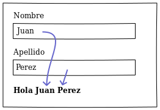
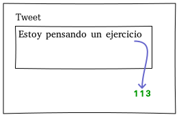
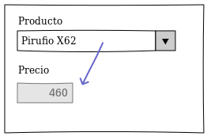
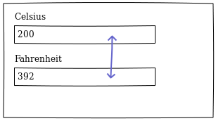
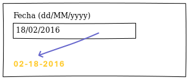

# Ejercicios para practicar Arena

## Ejercicio 1

Hacer una ventana que contenga

- un label Nombre acompañado de un campo editable
- un label Apellido acompañado de un campo editable
- un label saludo

Cuando el usuario escriba Nombre o Apellido en el label saludo debe escribirse el string "Hola " + nombre + " " + apellido.

## Ejercicio 2

Hacer una ventana que contenga

- un label Operando1 acompañado de un campo editable numérico
- un label Operando2 acompañado de un campo editable numérico
- un botón que puede ser "+", "-", "*" ó "/"
- un label resultado

Cuando el usuario presione el botón debe calcularse el resultado y mostrarse en el label.

**Variante:** hacer la operación por defecto (elija una) a medida que se modifiquen los operandos 1 ó 2.

## Ejercicio 3

Hacer una ventana que contenga

- un label Frase acompañado de un campo editable
- un label Conversión

Cuando el usuario escriba una frase debe aparecer en el label Conversión la palabra al revés. 

**Bonus:** si la palabra es palíndromo debe aparecer en azul, o bien en rojo si no lo es.

> Un palíndromo es Palabra o expresión que es igual si se lee de izquierda a derecha que de derecha a izquierda.

## Ejercicio 4

Hacer una ventana que contenga un campo con un label Tweet, y un campo texto editable de 140 caracteres. Conforme el usuario va escribiendo debería decrementarse la cantidad de caracteres libres (140 - longitud del tweet)

*BONUS 2:* No dejar escribir al sobrepasar los 140 caracteres.
*BONUS 2:* Cuando queden menos de 5 caracteres mostrar el número en rojo.

## Ejercicio 5

Se tiene un combo de productos, objetos que tienen como propiedades precio de venta y descripción. Al seleccionar un elemento debe mostrar en otro label el precio de dicho producto.

## Ejercicio 6

Realizar el conversor de Celsius a Fahrenheit o viceversa mediante dos campos editables. Cuando se modifique uno debe actualizarse el valor del otro.

## Ejercicio 7

La pantalla debe tener un campo fecha editable `dd/MM/yyyy`. A medida que escribe la fecha debe determinar si es válida, y en caso afirmativo, calcular cuántos días pasaron desde el día de hoy hasta esa fecha (puede ser negativo a priori).

**BONUS:** Permitir ingresar sólo fechas anteriores. 

## Ejercicio 8

Ingresar un campo fecha editable en formato `dd/MM/yyyy` y cuando sea válida mostrarla en un label en formato `MM-dd-yyyy`.

**BONUS:** Si la fecha es posterior a la fecha de hoy mostrarla en verde, si es la fecha de hoy mostrarla en azul y si es anterior a la fecha de hoy mostrarla en amarillo.